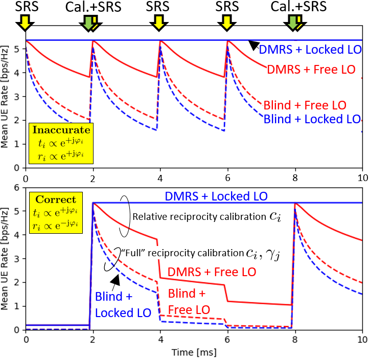
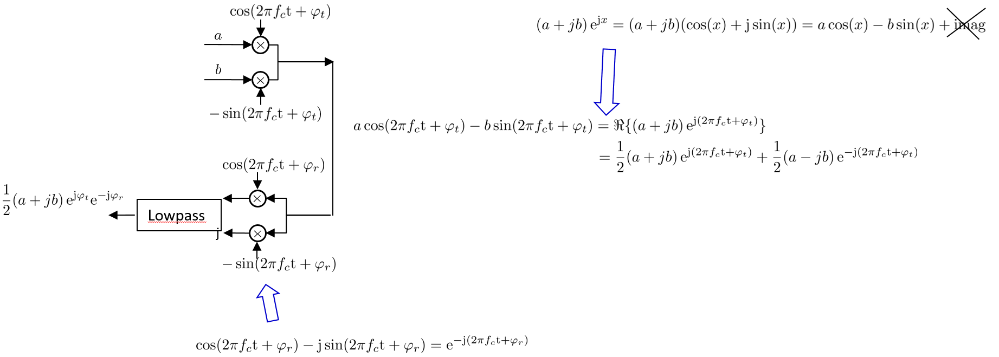

# Correctly Modeling TX and RX Chain in (Distributed) Massive MIMO - New FundamentalInsights on Coherency

This repository allows to reproduce the numerical results of R. Nissel, [“Correctly Modeling TX and RX Chain in
(Distributed) Massive MIMO - New FundamentalInsights on Coherency”](https://arxiv.org/pdf/2206.14752), submitted to IEEE Communications Letters, 2022,  which showed that  the TX and RX models commonly used in literature for downlink (distributed) massive MIMO are wrong, leading also to wrong conclusions.
For example, free-running LOs and the commonly made assumption of perfect reciprocity calibration (to enable simple blind DL channel estimation) are both not that useful. Instead, the LOs at the base stations should be locked and relative reciprocity calibration in combination with downlink demodulation reference symbols should be employed.


## Requirements
Windows 10 (64bit) and Python 3.8 but newer versions (and some older) should also work.


## Reproducible Figures

To reproduce Figure 5, please run [`LOeffectOnDistributedMassiveMIMO.py`](LOeffectOnDistributedMassiveMIMO.py)

* **Wrong Model**: 
Please set line 22 to
```
CorrectTXandRXmodel = False 
```

* **Correct Model**: 
Please set line 22 to
```
CorrectTXandRXmodel = True 
```




Note that in my paper I made a lot of simplyfing assumptions to make the paper and the code as clear and easy to follow as possible (the key conclusions of course still hold even in a more realistic setup). To make the simulation more realistic, one needs: 
* A more realistic channel model, e.g., Quadriga + Polarization + Antenna pattern + three sectors per site
* Full time-frequency grid e.g., 3300 subcarriers + 1400 OFDM symbols
* Perform "realistic" calibration and channel estimation (i.e., SRS and DMRS are at a certain time-frequency position and noise and interference will cause errors)
* Include switching time between UL and DL transmission
* Include coding and decoding + (different MCS) and not only rate calculations, etc.


## Additional Explanations
In addition to reproducing Figure 5, also the analytical derivation steps in the appendix can be double-checked by simulations. For that, please run  [`TxRxChainTheoryVsSimulation.py`](TxRxChainTheoryVsSimulation.py). 

Moreover, in the appendix I kept the explanations quite compact because of size constraints. In the following, please find a simplified derivation of the +φ LO effect in the TX chain and -φ LO effect in the RX chain:



## Please Cite My Paper

    @article{Nissel2022,
		author    = {R. Nissel},
		journal   = {submitted to IEEE Communications Letters},
		title     = {Correctly Modeling {TX} and {RX} Chain in (Distributed) Massive {MIMO} - New Fundamental Insights on Coherency},
		year 	  = {2022},
		volume 	  = {xx},
		number 	  = {xx},
	}


## References
- R. Nissel, [“Correctly Modeling TX and RX Chain in (Distributed) Massive MIMO - New Fundamental Insights on Coherency”](https://arxiv.org/pdf/2206.14752), submitted to IEEE Communications Letters, 2022.
- R. Nissel, S. Schwarz, and M. Rupp, [“Filter bank multicarrier modulation schemes for future mobile communications”](https://publik.tuwien.ac.at/files/publik_260162.pdf), IEEE Journal on Selected Areas in Communications, vol. 35, no. 8, pp. 1768–1782, 2017.
- R. Nissel, [“Filter bank multicarrier modulation for future wireless systems”](http://publik.tuwien.ac.at/files/publik_265168.pdf), Dissertation, TU Wien, 2017.


